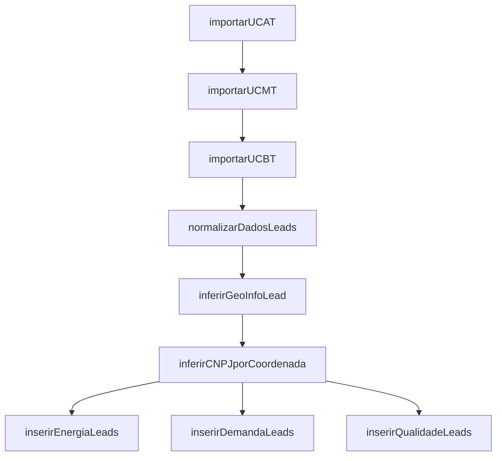

# Youon Intelligence – Plataforma de Inteligência Comercial para o Setor de Energia

Bem-vindo à plataforma **Youon Intelligence**, uma solução robusta e escalável voltada para mapeamento, enriquecimento e priorização de leads estratégicos no setor de energia brasileiro. O sistema coleta e cruza dados da ANEEL com APIs externas como CNPJá e Google Maps, alimentando um pipeline de inteligência comercial dividido por segmentos: **C\&I (Comercial e Industrial)**, **Home** (futuro), e **GTD** (Governamental e Grandes Consumidores).

---

## 🧠 Visão Geral

* 🗕️ Importação automatizada de dados públicos da ANEEL (BDGD);
* 🧠 Enriquecimento com dados de CNPJ, localização, CNAE e nome fantasia;
* 🔎 Classificação inteligente dos leads em HOT, WARM ou COLD;
* 🟘 Visualização futura em mapas com filtros por região, prioridade e segmento;
* 🔧 Sugestão futura de soluções ideais baseadas em consumo, demanda e qualidade.

---

## 🧱 Estrutura Final de Pastas

```bash
youon-inteligence/
├── apps/
│   ├── backend/
│   │   ├── prisma/
│   │   ├── data/
│   │   ├── docs/
│   │   ├── src/
│   │   │   ├── api/
│   │   │   ├── controllers/
│   │   │   ├── services/
│   │   │   ├── jobs/
│   │   │   │   ├── importers/
│   │   │   │   ├── normalizadores/
│   │   │   │   ├── enrichment/
│   │   │   │   ├── quality/
│   │   │   │   ├── classification/
│   │   │   │   └── orchestrators/
│   │   │   ├── utils/
│   │   │   ├── database/
│   │   │   └── server.ts
│   └── frontend/
│       └── src/
│           ├── components/
│           ├── layouts/
│           ├── pages/
│           ├── services/
│           └── styles/
├── infra/
├── packages/
├── README.md
```

---

## 🚀 Pipeline de Execução



### Ordem de Execução

1. `importarUCAT`
2. `importarUCMT`
3. `importarUCBT`
4. `normalizarDadosLeads`
5. `inferirGeoInfoLead`
6. `inferirCNPJporCoordenada`
7. `inserirEnergiaLeads`
8. `inserirDemandaLeads`
9. `inserirQualidadeLeads`

---

## 📦 Instalação e Execução

```bash
git clone https://github.com/GuilhermeCostaProenca/youon-inteligence.git
cd apps/backend

# .env
DATABASE_URL="file:./dev.db" # ou PostgreSQL URL
GOOGLE_API_KEY=...
CNPJA_TOKEN=...

npm install
npx tsx src/jobs/orchestrators/importarTudo.job.ts
```

---

## 📚 Dicionário dos Datasets ANEEL

| Dataset   | Segmento | Tensão | Sigla | Link                                                  |
| --------- | -------- | ------ | ----- | ----------------------------------------------------- |
| UCAT\_tab | C\&I     | Alta   | UCAT  | [Link ANEEL](https://dados.aneel.gov.br/dataset/ucat) |
| UCMT\_tab | C\&I     | Média  | UCMT  | [Link ANEEL](https://dados.aneel.gov.br/dataset/ucmt) |
| UCBT\_tab | C\&I     | Baixa  | UCBT  | [Link ANEEL](https://dados.aneel.gov.br/dataset/ucbt) |

Campos comuns: `COD_ID_ENCR`, `CLAS_SUB`, `GRU_TAR`, `TIP_CC`, `DIST`, `MUN`, `CNPJ`, etc.

---

## 🛠 Requisitos Técnicos

* Node.js 18+
* Prisma ORM
* SQLite (dev) e PostgreSQL (produção)
* React + Tailwind (frontend)
* APIs: CNPJá, Google Maps
* CRON jobs ou scripts agendados

---

## 🧽 Timeline de Desenvolvimento

### ✅ Fase 1: Setup Base

* Estrutura monorepo e pastas
* Tabelas Prisma: `LeadBruto`, `LeadEnergia`, `LeadDemanda`, `LeadQualidade`, `LeadEnriquecido`
* Configuração SQLite

### ✅ Fase 2: Importação ANEEL

* Scripts `importarUCAT`, `importarUCMT`, `importarUCBT`
* Validação e merge dos dados no banco

### ✅ Fase 3: Normalização e Enriquecimento

* `normalizarDadosLeads`
* APIs externas para CNPJ, CNAE, endereço
* `inferirGeoInfoLead`, `inferirCNPJporCoordenada`

### ✅ Fase 4: Qualidade

* Jobs para `lead_energia`, `lead_demanda`, `lead_qualidade`
* Baseados em dados combinados UCAT + UCMT + UCBT

### 🔜 Fase 5: Classificação

* Algoritmo de HOT/WARM/COLD
* Regras baseadas em consumo, qualidade, perfil econômico

### 🔌 Fase 6: API REST

* Endpoints: `/leads`, `/lead/:id`, filtros e paginação
* Swagger ou Postman

### 🎨 Fase 7: Frontend React

* Mapa interativo com filtros
* Cards de lead com dados técnicos
* Tela detalhada de oportunidades

### 🛁 Fase 8: Produção & Escalabilidade

* PostgreSQL na Azure
* Agendamento de jobs
* Monitoramento e logging

### 🌟 Fase 9: Versão 2.0

* Docker + Deploy
* LGPD compliance
* Machine Learning para recomendação de solução

---

## 👨‍💼 Desenvolvedor Responsável

**Guilherme Costa Proença**
[GitHub](https://github.com/GuilhermeCostaProenca)
